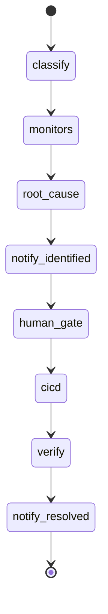

# AI Usage — Publisher Support Agent

> Este doc no es una lista de prompts. Queremos ver cómo el equipo arquitecturó el uso de IA: qué patrones eligieron, qué infra construyeron alrededor, dónde dejaron de tratar al modelo como un autocomplete y empezaron a tratarlo como un componente del sistema.

---

## Stack de IA

| Capa | Qué usamos | Por qué eso y no otra cosa |
|---|---|---|
| Modelos | **Claude Sonnet 4.6** (`claude-sonnet-4-6`) vía Anthropic API | Classifier + RCA con structured tool outputs; temperature=0 |
| IDE / agentic coding | Cursor (plan mode + agent) | Desarrollo acelerado del hackathon con revisión humana |
| Orquestación / agents | **LangGraph** StateGraph | Multi-agente con nodos, edges condicionales y estado compartido `CaseState` |
| MCPs usados | Ninguno en runtime del producto | No requerido para el scope del hackathon |
| Skills custom | Ninguna | — |
| RAG / búsqueda | Ninguno en v1 | Contexto estructurado desde adapters mock es suficiente para demo |
| Evals / testing de IA | pytest con mock de `invoke_structured` + test fail-hard sin API key | Tests no llaman a Anthropic; validan contrato y escalamiento |
| Observabilidad | SSE + `AuditEvent` por agente → consola demo | Trazabilidad en tiempo real para video y debugging |

---

## Arquitectura del uso de IA

### IA en el producto (runtime)

**Flujo que dispara la llamada:**
1. Publisher envía mensaje en UI WhatsApp → `POST /cases`
2. LangGraph ejecuta: Supervisor → Classifier → Monitores → RCA → Notify → Human → CI/CD → Verify → Notify

**Context que recibe Claude:**
- **Classifier:** consulta del publisher + catálogo de escenarios válidos + hint opcional de chip demo
- **RCA:** `ClassifiedQuery` + `monitor_results` JSON + `stacktrace` del escenario + timeline reciente

**Tools disponibles:**
- Anthropic tool use con schemas Pydantic (`ClassifierLLMOutput`, `RCALLMOutput`)
- Monitores mock invocados determinísticamente (no LLM)

**Decisiones del modelo vs hardcoded:**
| Decisión | Quién |
|----------|-------|
| Clasificación NL + scenario_id | **Claude** (Classifier) |
| Invocación monitores | Hardcoded fan-out |
| RCA + propuesta de código | **Claude** (RCA) |
| Fail sin API key / error LLM | Hardcoded → escalated |
| confidence < 0.6 | Hardcoded → escalated |
| Human gate, CI/CD, verify | Hardcoded |
| Mensajes al publisher (3 hitos) | Templates deterministas |

### IA en el proceso de desarrollo

- **Plan mode en Cursor:** arquitectura multi-agente, UI split-screen y plantillas hackathon definidas antes de implementar.
- **Agent mode:** generación de backend (LangGraph, adapters, SSE) y frontend (React WhatsApp clone).
- **Ritual:** plan → revisión humana → ejecución → pytest como verificación.
- **Confianza vs reescritura:** lógica operativa (gates, verify, SSE) escrita/revisada manualmente; boilerplate y UI generados por agente con ajustes.

---

## Patrones avanzados que usaste

- [ ] **Skills custom**
- [x] **Sub-agents / multi-agent** — 7 nodos LangGraph con roles: Supervisor, Classifier, 5 Monitores, RCA, Human, CI/CD, Verify, Notify. Coordinación vía `CaseState` compartido.
- [ ] **MCP custom**
- [x] **Tool use / function calling** — Anthropic tool use con JSON schema Pydantic para Classifier y RCA.
- [ ] **RAG / context retrieval**
- [x] **Context engineering** — RCA recibe snapshots + stacktrace; prompts en `agents/prompts/`; Classifier recibe catálogo de escenarios.
- [x] **Structured outputs** — Pydantic v2 (`ClassifiedQuery`, `RootCauseReport`, `PatchProposal`, `VerificationResult`).
- [x] **Memoria / estado** — `CaseState` in-memory por caso; timeline `AuditEvent[]` persistido en store.
- [ ] **Routing entre modelos**
- [ ] **Self-correction / reflection**
- [x] **Evals automáticos** — pytest valida 3 mensajes WhatsApp, orden checking→identified→resolved, presencia de agentes en timeline.
- [x] **Human-in-the-loop** — gate antes de CI/CD; auto-approve en `VIDEO_DEMO` para grabación.
- [x] **Determinismo / temperature control** — temperature=0 en Claude; fail-hard sin fallback rule-based.
- [ ] **Prompt caching**
- [x] **Streaming + UX** — SSE de eventos a consola y burbujas WhatsApp (no streaming de tokens LLM al UI).

---

## Decisiones de arquitectura

**Decisión 1:** LangGraph en lugar de loop asyncio custom
- Alternativas que descartamos: Celery pipeline, single-agent monolítico
- Trade-off: más boilerplate inicial, pero grafo explícito y extensible

**Decisión 2:** Mocks con contrato `MonitorAdapter` en lugar de integraciones reales
- Alternativas: conectar staging GCP/MySQL (requiere credenciales y tiempo)
- Trade-off: demo creíble sin deps externas; interfaces listas para prod

**Decisión 3:** Claude con structured tool outputs (fail-hard sin API key)
- Alternativas: keywords rule-based, fallback silencioso a rules
- Trade-off: requiere `ANTHROPIC_API_KEY`; tests mockean `invoke_structured`

**Decisión 4:** SSE único para consola y WhatsApp
- Alternativas: polling + websockets separados
- Trade-off: un bus de eventos simplifica sincronización split-screen

---

## Context engineering

- **System prompt estable:** `agents/prompts/classifier.md` y `agents/prompts/rca.md`
- **Usuario vs inferido:** consulta cruda + catálogo de escenarios; RCA recibe stacktrace mock por escenario
- **Guardrail post-LLM:** Pydantic validation + retry 1x + confidence threshold 0.6

---

## Failure modes

- **Sin API key:** caso escalado con audit `[System] Error LLM: ANTHROPIC_API_KEY no configurada`
- **API falla o JSON inválido:** retry 1x → escalated (sin fallback a keywords)
- **confidence < 0.6:** escalated antes de proponer deploy

---

## Lo que probaron y descartaron

- Rule-based keywords descartado en runtime — reemplazado por Claude Classifier
- Fallback silencioso a rules descartado — fail-hard acordado con el equipo

---

## Métricas (estimadas)

- Código generado por IA y dejado tal cual: ~70%
- Código generado por IA y editado: ~20%
- Código escrito a mano: ~10%
- Tiempo ahorrado total estimado: ~4x

---

## Aprendizajes

1. **Separar IA de gates deterministas** — verify y human approval no deben ser probabilísticos.
2. **SSE como observabilidad** — esencial para demo multi-agente comprensible en video.
3. **Mocks con schema real** — aceleran hackathon y facilitan migración a prod sin reescribir agentes.
