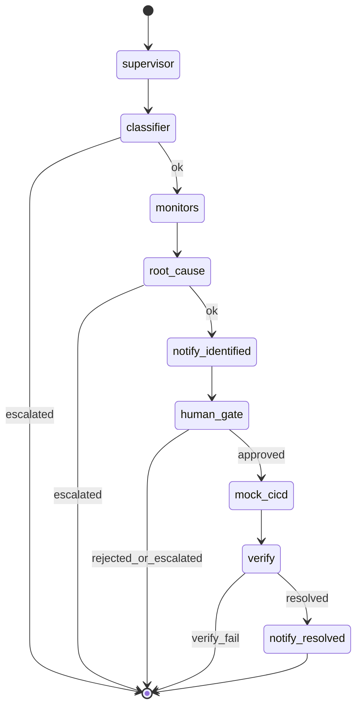

# AI Usage — Publisher Support Agent

> Este doc no es una lista de prompts. Queremos ver cómo el equipo arquitecturó el uso de IA: qué patrones eligieron, qué infra construyeron alrededor, dónde dejaron de tratar al modelo como un autocomplete y empezaron a tratarlo como un componente del sistema.

**Estado:** branch `main` post-hackathon (Team 14) — integración Anthropic en Classifier + RCA, verificación determinista con mock checks, demo UI split-screen + inbox.

---

## Stack de IA

| Capa | Qué usamos | Por qué eso y no otra cosa |
|---|---|---|
| Modelos | **Claude Sonnet 4.6** (`claude-sonnet-4-6`) vía Anthropic API | Classifier + RCA con structured tool outputs; `temperature=0` |
| IDE / agentic coding | **Cursor** (plan mode + agent) | Arquitectura, backend LangGraph, demo UI, tests y docs del hackathon con revisión humana |
| Orquestación / agents | **LangGraph** StateGraph | Multi-agente con nodos, edges condicionales y estado compartido `CaseState` |
| MCPs usados | Ninguno en runtime del producto | No requerido para el scope del hackathon |
| Skills custom | Ninguna | — |
| RAG / búsqueda | Ninguno en v1 | Contexto estructurado desde escenarios JSON + monitores mock |
| Evals / testing de IA | pytest + mock global de `invoke_structured` en `conftest.py` | Tests no llaman a Anthropic; validan contrato LLM, escalamiento y flujo E2E |
| Observabilidad | SSE + `AuditEvent` por agente → consola demo | Trazabilidad en tiempo real para video y debugging |

---

## Arquitectura del uso de IA

### IA en el producto (runtime)

**Flujo que dispara la llamada:**
1. Publisher envía mensaje en UI WhatsApp → `POST /cases`
2. LangGraph ejecuta: Supervisor → **Classifier (Claude)** → Monitores → **RCA (Claude)** → Notify → Human → CI/CD → **Verify (mock checks + monitores)** → Notify

**Context que recibe Claude:**

| Nodo | System prompt | User prompt |
|------|---------------|-------------|
| **Classifier** | `agents/prompts/classifier.md` | `publisher_id`, consulta cruda, catálogo de escenarios válidos (`list_scenarios()`), hint opcional si el chip demo envió `scenario_id` |
| **RCA** | `agents/prompts/rca.md` | `ClassifiedQuery`, `monitor_results` JSON, `stacktrace` del escenario, timeline reciente (últimos 8 eventos) |

**Tools disponibles (Anthropic tool use):**
- `classify_publisher_query` → `ClassifierLLMOutput` (Pydantic)
- `propose_root_cause_and_fix` → `RCALLMOutput` (Pydantic, incluye `files[].content` con código)

**Componentes sin LLM (deterministas):**
- 5 monitores mock (`MockMonitorAdapter`, `pre_fix` / `post_fix` por escenario)
- Mock checks post-fix (`checks.post_fix` en JSON de escenario → agente `[Checks]`)
- Human gate, CI/CD mock, re-monitoreo en Verify
- Mensajes WhatsApp (3 hitos: checking → identified → resolved)

**Decisiones del modelo vs hardcoded:**

| Decisión | Quién |
|----------|-------|
| Clasificación NL + `scenario_id` | **Claude** (Classifier) |
| Invocación monitores (fan-out x5) | Hardcoded |
| RCA + propuesta de patch con código | **Claude** (RCA) |
| Sin API key / error LLM / JSON inválido | Hardcoded → `escalated` |
| `confidence < RCA_CONFIDENCE_THRESHOLD` (0.6) | Hardcoded → `escalated` |
| Smoke checks post-fix | Hardcoded runner sobre fixtures JSON |
| Resolución del caso (`tests_pass` + `monitors_healthy`) | Hardcoded en Verify |
| Human gate, CI/CD | Hardcoded |
| Texto al publisher | Templates deterministas (summary del RCA en identified/resolved) |



### Cliente LLM (`llm/client.py`)

- `invoke_structured()` centraliza llamadas a Anthropic.
- **Tool choice forzado** al schema Pydantic del nodo.
- **Hasta 3 reintentos** si la validación Pydantic falla o la API responde error (con feedback al modelo en el retry).
- **Fail-hard** si `ANTHROPIC_API_KEY` no está en `.env` — no hay fallback rule-based en runtime.

### Verificación post-fix (no LLM)

Capa de **mock checks** separada de los monitores de infra:

- Cada escenario define `checks.post_fix[]` en `scenarios/*.json` (id, name, pass).
- El nodo Verify ejecuta checks + re-monitoreo `post_fix` y emite `[Checks]` y `[Verify]` en consola.
- `tests_pass` = patch aplicado ∧ checks OK; `resolved` = tests_pass ∧ monitores healthy.

Esto permite mostrar en demo una verificación en dos capas (smoke de negocio + salud de sistemas) sin depender del modelo.

### IA en el proceso de desarrollo

- **Plan mode (Cursor):** arquitectura multi-agente, mock checks en verificación, guion de demo, plantillas hackathon.
- **Agent mode (Cursor):** backend (LangGraph, adapters, SSE, integración Anthropic), frontend (WhatsApp clone, inbox, consola), scripts (`record_demo.sh`, `demo_case.sh`), tests.
- **Ritual del equipo:** plan → revisión humana → implementación → `pytest` → merge a `main`.
- **Confianza vs reescritura:** gates operativos (verify, human, checks) y contratos LLM revisados manualmente; boilerplate, UI y tests generados/asistidos por agente con ajustes del equipo.

---

## Patrones avanzados que usaste

- [ ] **Skills custom**
- [x] **Sub-agents / multi-agent** — nodos LangGraph: Supervisor, Classifier, 5 Monitores, RCA, Human, CI/CD, Checks, Verify, Notify. Coordinación vía `CaseState`.
- [ ] **MCP custom**
- [x] **Tool use / function calling** — Anthropic forced tool use con JSON schema derivado de Pydantic.
- [ ] **RAG / context retrieval**
- [x] **Context engineering** — catálogo de escenarios inyectado al Classifier; RCA recibe snapshots + stacktrace + timeline; prompts versionados en `agents/prompts/`.
- [x] **Structured outputs** — `ClassifierLLMOutput`, `RCALLMOutput`, `VerificationResult`, `CheckResult`; validadores Pydantic con defaults para campos faltantes del modelo.
- [x] **Memoria / estado** — `CaseState` in-memory por caso; timeline `AuditEvent[]` + SSE.
- [ ] **Routing entre modelos**
- [ ] **Self-correction / reflection** — solo retry automático ante JSON inválido (hasta 3 intentos).
- [x] **Evals automáticos** — pytest E2E (happy path, orden de mensajes, agentes en timeline), tests de schemas LLM, test de escalamiento sin API key.
- [x] **Human-in-the-loop** — gate antes de CI/CD; auto-approve en `VIDEO_DEMO` para grabación.
- [x] **Determinismo / temperature control** — `temperature=0`; monitores, checks y verify no son probabilísticos.
- [ ] **Prompt caching**
- [x] **Streaming + UX** — SSE de eventos a consola y burbujas WhatsApp (no streaming de tokens LLM al UI).

---

## Decisiones de arquitectura

**Decisión 1:** LangGraph en lugar de loop asyncio custom  
- Alternativas: Celery pipeline, single-agent monolítico  
- Trade-off: más boilerplate, grafo explícito y extensible para demo/jurado

**Decisión 2:** Mocks con contrato `MonitorAdapter` + `checks.post_fix` en JSON  
- Alternativas: integraciones reales a GCP/MySQL/SAP (credenciales, tiempo)  
- Trade-off: demo creíble sin deps externas; interfaces listas para prod

**Decisión 3:** Claude con structured tool outputs (fail-hard sin API key)  
- Alternativas: keywords rule-based (`detect_scenario` quedó solo para tests legacy)  
- Trade-off: requiere `ANTHROPIC_API_KEY` en demo real; pytest mockea `invoke_structured`

**Decisión 4:** Verificación en dos capas (checks + monitores) sin LLM  
- Alternativas: que el modelo declare resuelto  
- Trade-off: cierre del caso auditable y reproducible en video demo

**Decisión 5:** SSE único para consola y WhatsApp  
- Alternativas: polling + websockets separados  
- Trade-off: un bus de eventos simplifica split-screen e inbox

---

## Context engineering

- **System prompts estables:** `agents/prompts/classifier.md`, `agents/prompts/rca.md`
- **Catálogo acotado:** el Classifier solo puede elegir entre 5 `scenario_id` del repo (validado por `Literal` en Pydantic)
- **RCA grounded:** stacktrace y monitores vienen del escenario elegido — el modelo correlaciona, no inventa infra
- **Guardrails post-LLM:** validación Pydantic + retry + umbral de confianza RCA + escalamiento con mensaje al publisher

---

## Failure modes

| Condición | Comportamiento |
|-----------|----------------|
| Sin `ANTHROPIC_API_KEY` | Caso `escalated`; audit `[System] Error LLM: ANTHROPIC_API_KEY no configurada...` |
| Error Anthropic / JSON inválido tras 3 intentos | `escalated` |
| `confidence < 0.6` en RCA | `escalated` antes de proponer deploy |
| Human rechaza patch | `escalated` |
| Checks o monitores post-fix fallan | Verify termina sin `notify_resolved` |

---

## Lo que probaron y descartaron

- **Keywords rule-based en runtime** — reemplazado por Claude Classifier (keywords solo en tests de adapters).
- **Fallback silencioso a rules** — descartado; fail-hard acordado con el equipo.
- **Mensajes al publisher generados por LLM** — descartado para demo; templates deterministas más predecibles en video.
- **Clasificación contextual por keywords con negación** — explorado en dev con Cursor; no mergeado a `main` (Claude cubre NL).

---

## Demo UI (desarrollo asistido por IA)

- **Vista split-screen:** WhatsApp + consola de agentes (SSE).
- **Vista Inbox:** pantalla alternativa de publishers (`InboxView`) para mostrar escala del producto.
- Chips de escenario + botón "Grabar demo" para flujo reproducible en video.

---

## Testing de IA

```bash
pytest   # mock automático de Claude en conftest (excepto test_missing_api_key_escalates)
```

| Archivo | Qué valida |
|---------|------------|
| `tests/conftest.py` | Mock de `invoke_structured` para Classifier y RCA |
| `tests/test_llm_agents.py` | Escalamiento sin API key; patch RCA con `content` |
| `tests/test_llm_schemas.py` | Defaults y validación de `RCALLMOutput` |
| `tests/test_api.py` | E2E: resolved, agentes Checks/Verify, orden de mensajes |
| `tests/test_adapters.py` | Monitores mock + keywords legacy |

---

## Variables de entorno (IA)

| Variable | Default | Descripción |
|----------|---------|-------------|
| `ANTHROPIC_API_KEY` | — | **Requerida** en demo real |
| `CLAUDE_MODEL` | `claude-sonnet-4-6` | Modelo para Classifier y RCA |
| `CLAUDE_MAX_TOKENS` | `2048` | Máximo tokens por llamada |
| `RCA_CONFIDENCE_THRESHOLD` | `0.6` | Bajo este umbral → escalated |

---

## Métricas (estimadas — Team 14)

- Código generado por IA y dejado tal cual: ~65%
- Código generado por IA y editado: ~25%
- Código escrito a mano: ~10%
- Tiempo ahorrado total estimado: ~4x vs implementación solo manual

---

## Aprendizajes

1. **Separar IA de gates deterministas** — Classifier/RCA pueden ser probabilísticos; verify, checks y human approval no.
2. **Structured tool use > texto libre** — schemas Pydantic evitan parseo frágil y habilitan retry con feedback.
3. **Fail-hard mejor que fallback silencioso** — el operador ve escalamiento claro en consola y timeline.
4. **Mocks con schema real** — monitores + checks aceleran hackathon y migración a prod sin reescribir el grafo.
5. **SSE como observabilidad** — esencial para demo multi-agente comprensible en video e inbox.

---

## Equipo

Christian Arce · Ignacio Puglisi · Eduardo Tamburrini · Lucas Nicolas Viale — Team 14, Hackathon QuintoAndar AI.
