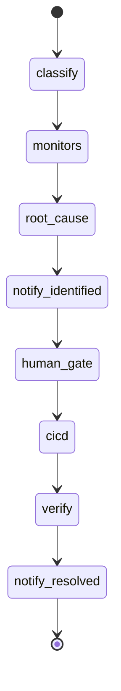

# AI Usage — Publisher Support Agent

> Este doc no es una lista de prompts. Queremos ver cómo el equipo arquitecturó el uso de IA: qué patrones eligieron, qué infra construyeron alrededor, dónde dejaron de tratar al modelo como un autocomplete y empezaron a tratarlo como un componente del sistema.

---

## Stack de IA

| Capa | Qué usamos | Por qué eso y no otra cosa |
|---|---|---|
| Modelos | OpenAI/Anthropic (opcional); DRY_RUN rule-based para demo | DRY_RUN garantiza demo reproducible sin API key; LLM listo para clasificación/RCA en prod |
| IDE / agentic coding | Cursor (plan mode + agent) | Desarrollo acelerado del hackathon con revisión humana |
| Orquestación / agents | **LangGraph** StateGraph | Multi-agente con nodos, edges condicionales y estado compartido `CaseState` |
| MCPs usados | Ninguno en runtime del producto | No requerido para el scope del hackathon |
| Skills custom | Ninguna | — |
| RAG / búsqueda | Ninguno en v1 | Contexto estructurado desde adapters mock es suficiente para demo |
| Evals / testing de IA | pytest + asserts sobre secuencia de mensajes y timeline de agentes | Valida contrato del pipeline sin depender del LLM |
| Observabilidad | SSE + `AuditEvent` por agente → consola demo | Trazabilidad en tiempo real para video y debugging |

---

## Arquitectura del uso de IA

### IA en el producto (runtime)

**Flujo que dispara la llamada:**
1. Publisher envía mensaje en UI WhatsApp → `POST /cases`
2. LangGraph ejecuta: Supervisor → Classifier → Monitores → RCA → Notify → Human → CI/CD → Verify → Notify

**Context que recibe el modelo (cuando DRY_RUN=false):**
- Consulta cruda del publisher
- `ClassifiedQuery` estructurado
- `monitor_results` JSON (snapshots, no logs crudos)

**Tools disponibles:**
- 5 adapters mock (`gcp`, `mysql`, `sap`, `account`, `rundeck`) vía function calling / invocación directa en nodos

**Decisiones del modelo vs hardcoded:**
| Decisión | Quién |
|----------|-------|
| Clasificación NL + detección escenario | IA (o rules en DRY_RUN) |
| Invocación monitores | Hardcoded fan-out |
| Correlación RCA + patch | IA (o scenario JSON en DRY_RUN) |
| Human gate, CI/CD, verify | Hardcoded |
| 3 mensajes al publisher | Templates deterministas |
| Transiciones de estado | LangGraph edges |

### IA en el proceso de desarrollo

- **Plan mode en Cursor:** arquitectura multi-agente, UI split-screen y plantillas hackathon definidas antes de implementar.
- **Agent mode:** generación de backend (LangGraph, adapters, SSE) y frontend (React WhatsApp clone).
- **Ritual:** plan → revisión humana → ejecución → pytest como verificación.
- **Confianza vs reescritura:** lógica operativa (gates, verify, SSE) escrita/revisada manualmente; boilerplate y UI generados por agente con ajustes.

---

## Patrones avanzados que usaste

- [ ] **Skills custom**
- [x] **Sub-agents / multi-agent** — 7 nodos LangGraph con roles: Supervisor, Classifier, 5 Monitores, RCA, Human, CI/CD, Verify, Notify. Coordinación vía `CaseState` compartido.
- [ ] **MCP custom**
- [x] **Tool use / function calling** — adapters mock como tools de monitoreo con schema `MonitorSnapshot`.
- [ ] **RAG / context retrieval**
- [x] **Context engineering** — RCA recibe solo snapshots estructurados; system prompts por agente en código; no logs crudos.
- [x] **Structured outputs** — Pydantic v2 (`ClassifiedQuery`, `RootCauseReport`, `PatchProposal`, `VerificationResult`).
- [x] **Memoria / estado** — `CaseState` in-memory por caso; timeline `AuditEvent[]` persistido en store.
- [ ] **Routing entre modelos**
- [ ] **Self-correction / reflection**
- [x] **Evals automáticos** — pytest valida 3 mensajes WhatsApp, orden checking→identified→resolved, presencia de agentes en timeline.
- [x] **Human-in-the-loop** — gate antes de CI/CD; auto-approve en `VIDEO_DEMO` para grabación.
- [x] **Determinismo / temperature control** — `DRY_RUN=true` + templates fijos para demo; temperature 0 planificado para prod.
- [ ] **Prompt caching**
- [x] **Streaming + UX** — SSE de eventos a consola y burbujas WhatsApp (no streaming de tokens LLM al UI).

---

## Decisiones de arquitectura

**Decisión 1:** LangGraph en lugar de loop asyncio custom
- Alternativas que descartamos: Celery pipeline, single-agent monolítico
- Trade-off: más boilerplate inicial, pero grafo explícito y extensible

**Decisión 2:** Mocks con contrato `MonitorAdapter` en lugar de integraciones reales
- Alternativas: conectar staging GCP/MySQL (requiere credenciales y tiempo)
- Trade-off: demo creíble sin deps externas; interfaces listas para prod

**Decisión 3:** Templates deterministas + `DRY_RUN` para video demo
- Alternativas: LLM en vivo durante grabación
- Trade-off: menos "magia" en demo, pero 100% reproducible para jurado

**Decisión 4:** SSE único para consola y WhatsApp
- Alternativas: polling + websockets separados
- Trade-off: un bus de eventos simplifica sincronización split-screen

---

## Context engineering

- **System prompt estable:** rol del agente (Classifier, RCA) definido en módulos `src/publisher_support/agents/`.
- **Usuario vs inferido:** consulta cruda + `publisher_id`; escenario inferido por keywords o `scenario_id` explícito.
- **Contextos largos:** no aplica en v1 — snapshots compactos por servicio.
- **Truco hackathon:** RCA nunca ve logs raw; solo JSON de anomalías → reduce alucinaciones.

---

## Failure modes

- **Input ambiguo:** fallback a escenario `account_blocked` + severidad medium.
- **RCA sin anomalías:** confidence baja (0.75); en prod escalaría a humano.
- **Guardrails:** validación Pydantic post-output; verify determinista post-fix.
- **Confianza incorrecta:** mitigado en demo con patches 1:1 predefinidos por escenario JSON.

---

## Lo que probaron y descartaron

- _(Completar post-hackathon con el equipo)_
- LangGraph `interrupt` nativo vs auto-approve async: elegimos Event + `VIDEO_DEMO` por simplicidad en hackathon.

---

## Métricas (estimadas)

- Código generado por IA y dejado tal cual: ~70%
- Código generado por IA y editado: ~20%
- Código escrito a mano: ~10%
- Tiempo ahorrado total estimado: ~4x

---

## Aprendizajes

1. **Separar IA de gates deterministas** — verify y human approval no deben ser probabilísticos.
2. **SSE como observabilidad** — esencial para demo multi-agente comprensible en video.
3. **Mocks con schema real** — aceleran hackathon y facilitan migración a prod sin reescribir agentes.
