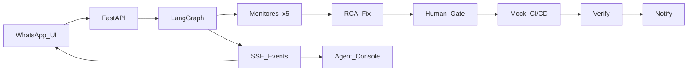

# Publisher Support Agent

> Agente multi-agente de soporte para publishers Navent/QuintoAndar: recibe consultas vía WhatsApp simulado, diagnostica la plataforma y resuelve incidentes con aprobación humana.

---

## Equipo

- Team 14 — Hackathon QuintoAndar AI

Christian Arce - Senior Engineering Manager
Ignacio Puglisi - Operation Analyst
Eduardo Tamburrini - Software Engineer
Lucas Nicolas Viale - Software Engineer

## Link al repositorio

🔗 [https://github.com/charce36/ai-hackathon-team-14](https://github.com/charce36/ai-hackathon-team-14)

## El problema

Los publishers de Zonaprop y portales Navent reportan fallas operativas.

- **A quién le pasa:** publishers e inmobiliarias que operan en la plataforma.
- **Cómo se resuelve hoy:** equipos de Ops revisan manualmente — proceso lento y sin trazabilidad unificada para el cliente.
- **Por qué no alcanza:** alta latencia, falta de comunicación proactiva al publisher y correlación manual entre sistemas.

## La solución

Construimos un **orquestador multi-agente** (LangGraph + FastAPI) que:

1. Recibe la consulta del publisher (UI tipo WhatsApp).
2. Clasifica el incidente y ejecuta **5 agentes de monitoreo** en paralelo (GCP, MySQL, SAP, cuenta, Rundeck).
3. Identifica causa raíz y propone un fix.
4. Pasa por **aprobación humana** y simula CI/CD.
5. Verifica la solución y notifica al publisher en **3 mensajes**: verificando → identificado + ETA → resuelto.

La demo usa **pantalla dividida**: celular WhatsApp a la izquierda y consola de agentes en tiempo real a la derecha (SSE).

**Diferenciador:** no es un chatbot genérico — es un pipeline operativo con gates deterministas, mocks extensibles a sistemas reales y trazabilidad completa por agente.

## Aplicabilidad en QuintoAndar / Zonaprop / Tokko

- **Producto:** soporte a publishers en Zonaprop (ZP) y portales RELA — canal WhatsApp Business + consola Ops interna.
- **Problema operativo:** reducir MTTR de incidentes recurrentes.
- **Equipo natural:** Ops / Platform Engineering + Customer Success publishers.

## ¿Por qué IA acá no es decorativa?

- **Clasificación NL:** el publisher describe el problema en lenguaje natural; el agente extrae categoría, severidad y servicios afectados.
- **Correlación RCA:** sintetiza snapshots de 5 dominios en una hipótesis accionable.
- **Mensajes contextuales:** redacta updates al publisher según estado del caso.

Sin IA quedaría un **router de tickets estático** por keywords — funcional pero sin adaptación ni síntesis. La IA aporta interpretación de consultas ambiguas y explicaciones legibles al cliente.

## Cómo correrlo

```bash
# Requisitos previos: Python 3.11+, Node 18+

# Instalación
cd ai-hackathon-team-14
python3 -m venv .venv && source .venv/bin/activate
pip install -e ".[dev]"
cp .env.example .env
# Editar .env y setear ANTHROPIC_API_KEY=sk-ant-...

cd demo-ui && npm install && npm run build && cd ..

# Cómo arrancar (ANTHROPIC_API_KEY requerida en .env)
VIDEO_DEMO=true uvicorn publisher_support.main:app --host 0.0.0.0 --port 8000
# Abrir http://localhost:8000/demo

# Tests
pytest

# Script CLI de demo
chmod +x scripts/demo_case.sh && ./scripts/demo_case.sh
```

### Variables de entorno necesarias

| Variable | Default | Descripción |
|----------|---------|-------------|
| `ANTHROPIC_API_KEY` | — | **Requerida** — API key de Claude Platform |
| `CLAUDE_MODEL` | `claude-sonnet-4-6` | Modelo Claude para Classifier y RCA |
| `CLAUDE_MAX_TOKENS` | `2048` | Máximo tokens por llamada |
| `RCA_CONFIDENCE_THRESHOLD` | `0.6` | Bajo este umbral el caso se escala a humano |
| `VIDEO_DEMO` | `true` | Auto-aprueba human gate + delays para video |
| `DEMO_STEP_DELAY_MS` | `800` | Pausa entre pasos en consola |
| `AUTO_APPROVE_DELAY_SEC` | `2` | Delay antes de auto-approve |

## Stack

- **Frontend:** React 18 + Vite + TypeScript (WhatsApp clone + consola SSE)
- **Backend:** FastAPI + uvicorn + sse-starlette
- **AI / modelos:** LangGraph + **Claude (Anthropic API)** en Classifier y RCA con structured outputs; temperature=0
- **Infra / deploy:** local; mocks listos para cablear GCP/MySQL/SAP/Rundeck reales

## Arquitectura



## Limitaciones conocidas

- Adaptadores **mock** — no conecta a GCP/MySQL/SAP/Rundeck reales.
- WhatsApp **simulado** en UI — no usa WhatsApp Business API.
- Patches **predefinidos** por escenario (1:1 con fixtures JSON).

## Próximos pasos

1. Cablear adapters reales (read-only) a monitoreo prod.
2. Integrar WhatsApp Business API como canal de ingesta/notificación.
3. Evals automáticos sobre outputs del clasificador y RCA.

## AI Usage

Ver [AI_USAGE.md](./AI_USAGE.md) para el detalle de cómo usaron IA en el proceso.
